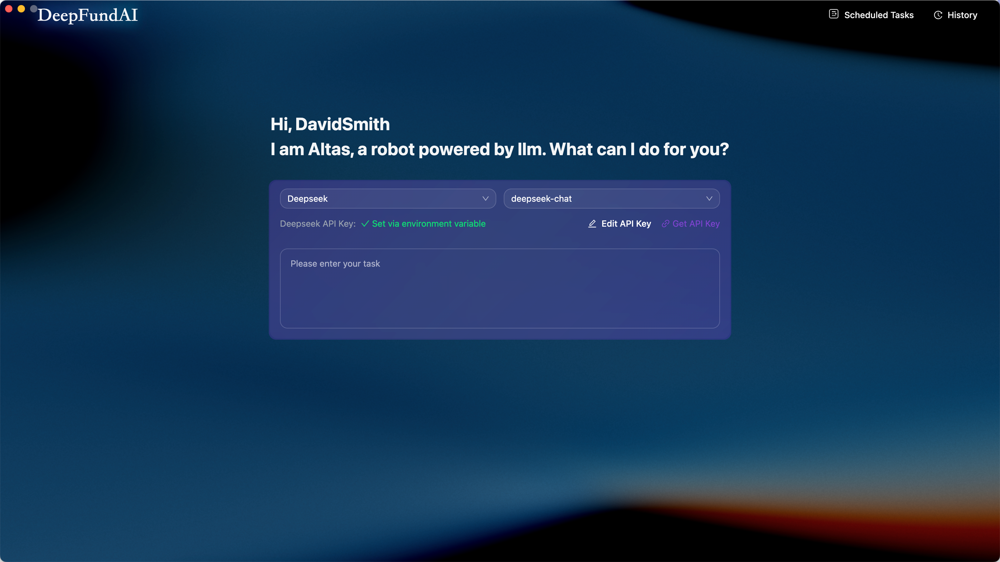
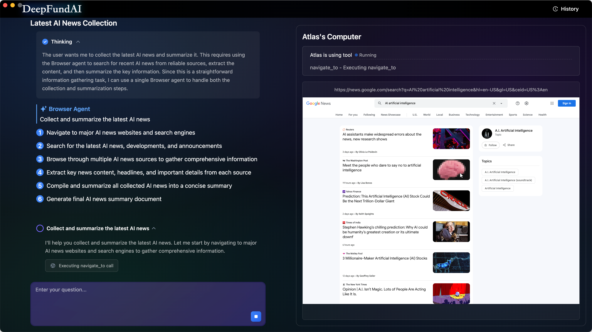
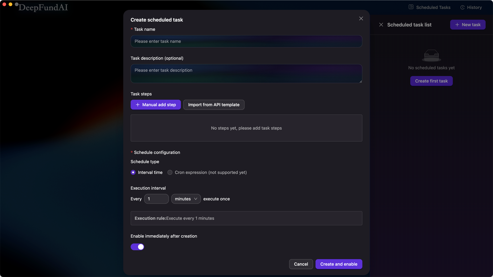
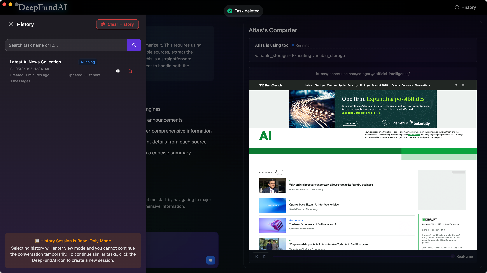

# DeepFundAI Browser

An AI-powered intelligent browser built with Next.js and Electron. Features multi-modal AI task execution, scheduled tasks, social media integration, and advanced file management capabilities.

Built with [Next.js](https://nextjs.org) and [Electron](https://electronjs.org).

## Tech Stack

- **Frontend**: Next.js 15 + React 19
- **Desktop**: Electron 33
- **UI**: Ant Design + Tailwind CSS
- **State Management**: Zustand
- **Storage**: IndexedDB (via electron-store)
- **AI Agent**: @jarvis-agent (based on [Eko](https://github.com/FellouAI/eko))
- **Build Tools**: Vite + TypeScript

## Development Environment Configuration
Node version: 20.19.3

## Getting Started

### 1. Configure API Keys

Before running the application, you need to configure API keys:

```bash
# Copy configuration template
cp .env.template .env.local

# Edit .env.local and fill in your API keys
# Required: DEEPSEEK_API_KEY, BAILIAN_API_KEY
```

For detailed configuration instructions, see [CONFIGURATION.md](./docs/CONFIGURATION.md).

### 2. Development Setup

First, run the development server:

```bash
# Install dependencies
pnpm install

# Build desktop application client
pnpm run build:deps

# Start web development server
pnpm run next

# Start desktop application
pnpm run electron
```

### 3. Building Desktop Application

To build the desktop application for distribution:

```bash
# Configure production API keys
# Edit .env.production file with your actual API keys

# Build the application
pnpm run build
```

The built application will include your API configuration, so end users don't need to configure anything.

## Features

- AI-powered intelligent browser
- Multi-modal AI task execution
- Scheduled tasks system
- Social media integration (Douyin, Xiaohongshu)
- Speech recognition and text-to-speech
- File management capabilities

## Screenshots

### Home
Input tasks and let AI execute automatically.



### Main
Left: AI thinking and execution steps. Right: Real-time browser operation preview.



### Scheduled Tasks
Create scheduled tasks with custom intervals and execution steps.



### History
View past tasks with search and playback capabilities.



## API Services Used

- **DeepSeek**: Main AI language model
- **Alibaba Cloud Bailian**: Vision model and social media services
- **OpenRouter**: Alternative AI models
- **Microsoft Azure**: Text-to-speech services

## Documentation

- [Configuration Guide](./docs/CONFIGURATION.md) - Detailed API key setup instructions

## Acknowledgements

Special thanks to [Eko](https://github.com/FellouAI/eko) - A production-ready agent framework that powers the AI capabilities of this project.

## Contributing

Please ensure all API keys are properly configured in development environment files only. Never commit actual API keys to the repository.